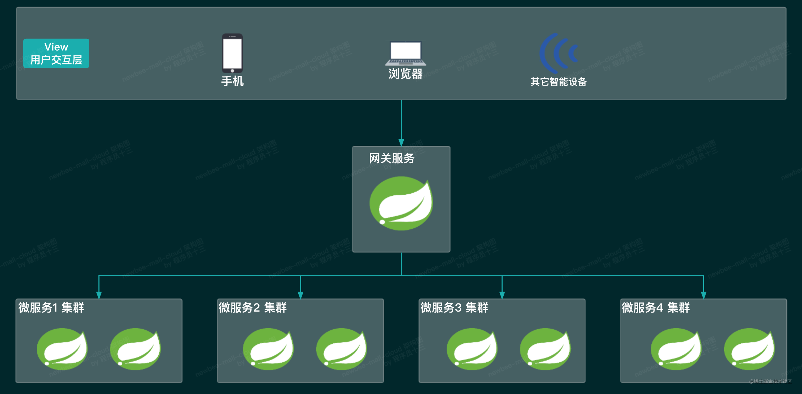
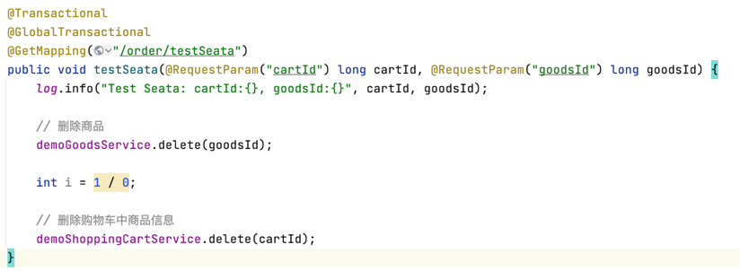
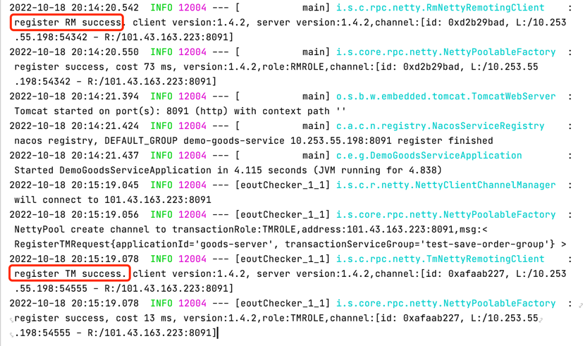
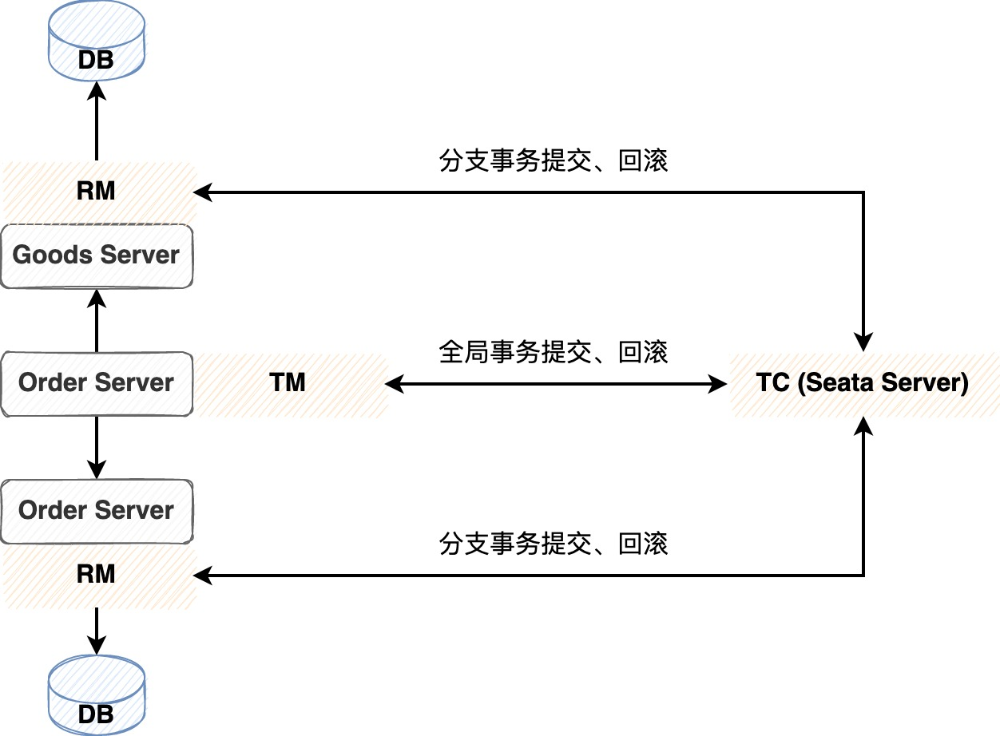
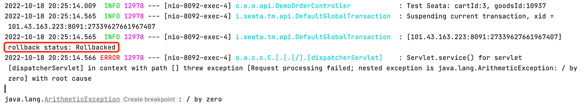

### [Spring Cloud Alibaba 大型微服务项目实战](https://s.juejin.cn/ds/6tgXRVH/)

### 1. 为什么要使用微服务？

1. 随着系统业务规模不断扩大，初始的系统无法执行越来越复杂的业务场景，此时便需要对系统进行优化，包括缓存、集群、前后端分离、数据库读写分离、
   做分布式和拆分微服务处理
   
2. 从开发团队来讲，当技术团队中人越来越多，越需要对系统的分工进行明确，拆分微服务便于职责分配

### 2. 服务治理
在没有服务治理之前，服务与服务之间的通信需要通过硬编码或者静态配置服务名称、IP、端口号的形式来满足通信条件，但是随着业务的发展，
微服务实例在不断增多，如果再用以上方法来配置就比较麻烦，当然可以采用Nginx反向代理来实现通信，
但是两个服务需要借助中间层代理来完成，就出现了新的**无法直连**的问题，增加了一次网络消耗，而且也需要在代理处配置被代理的服务器IP。
为了解决以上的问题，便出现了服务治理的思想。

服务治理中的三个核心问题：**服务注册**、**服务发现**和**服务的健康检查**

1. 服务注册
   
每个服务的实例在启动时向注册中心发出通知，将自己的服务名称、服务地址等信息提交到注册中心，注册中心将这些信息维护到实例清单中，这个过程就是服务注册。

2. 服务发现

服务调用方会从服务的注册中心获取被调用方的服务列表，或者由服务的注册中心将被调用方的服务列表变动信息推送给服务调用方，这个过程叫做**服务发现**。
接下来的服务通信是从这些服务列表通过负载均衡的算法选取一个服务进行调用。

3. 健康检查

所有的服务实例在注册中心注册成功后，每个服务实例都需要定时发送请求，告知注册中心自己的状态，业界一般称这个过程为 `heartbeat`，即 **“心跳”**。
如果注册中心在一段时间内没有收到某个服务实例的心跳信息，就会将这个服务实例标记为不可用或者不可达的状态，进而从可用的服务列表中剔除将该服务实例的信息，
在调用方查询可用的服务实例清单时，该服务实例的信息就不会返回给调用方。

### 3. 服务网关

- 为什么使用服务网关？
  - 统一通信方式，减少客户端的接入难度。可以使用服务网关对外提供RESTful风格的接口，请求到达网关后，由网关组件将请求转发到对应的微服务中
  - 服务网关作为客户端到微服务架构的唯一入口，管理所有的接入请求，可以统一接口的URL写法。同时，也能够作为一道屏障，屏蔽一些后端服务的处理细节
  - 服务网关可以对后端各个服务做统一的管控和配置管理，用于保护、增强和控制对于后端服务的访问
  - 服务网关可以做一些定制化编码，对请求进行统一的处理和拦截，从而完成一些前置处理，让隐藏在微服务网关后面的业务系统就可以更加专注于业务本身

服务网关是微服务架构中一个非常关键的角色，作为后端服务的统一入口，负责统筹和管理后端服务。
能够提供的功能有路由功能、负载均衡、安全认证、流量染色、灰度发布、限流熔断、协议转换、接口文档中心、日志收集等等

### 4. Seata分布式事务控制

分布式事务样例：**在订单服务中**，调用商品服务和购物车服务的删除方法，代码中有异常，那么事务执行过程中，任何删除操作都不能执行成功

分别启动商品服务、购物车服务和订单服务，在控制台中可以发现如下日志，可以发现注册了RM和TM两个角色

也就是说分别注册了**商品服务的RM、TM**和**购物车服务的RM、TM**和**订单服务的RM、TM**

那么什么是RM？什么又是TM？来看看官方文档的介绍图

- **RM**: Resource Manager，资源管理器。负责管理分支事务处理的资源，与TC交互，控制分支事务提交或回滚
- **TM**: Transaction Manager，事务管理器。负责定义全局事务的范围，开启、提交或回滚全局事务

其中还有TC，也一起看一下
- **TC**: Transaction Coordinator，事务协调者，是**Seata Server本体**。负责维护全局、分支事务的状态，驱动全局事务提交或回滚

如果以我们的分布式微服务系统为例，订单服务是事务的开端，所以全局事务管理器是订单服务的TM，做图示的话，如下

测试这个事务，控制台日志如下，可以发现事务发生异常后已经回滚

#### 4.1 AT模式下分布式事务控制原理

- AT模式: 基于支持本地 ACID 事务的关系型数据库; Java 应用，通过 JDBC 访问数据库

整体机制: 两阶段提交
- 一阶段: 业务数据和回滚日志记录在同一个本地事务中提交，释放本地锁和连接资源
- 二阶段: 
  - 提交异步化，非常快速地完成
  - 回滚通过一阶段的回滚日志进行反向补偿

[官方文档举例](https://seata.io/zh-cn/docs/overview/what-is-seata.html)

以系统中例子来描述：

OrderServer作为TC开启全局事务，拿到全局锁。

正常情况下：商品服务开启本地事务，执行业务数据更改并记录回滚日志，提交本地事务；购物车服务开启本地事务，执行业务数据更改并记录回滚日志，提交本地事务。

TC作为全局事务的管理者，根据事务执行过程中有没有发生异常来判断提交全局事务或者回滚全局事务，若回滚全局事务，则商品服务和购物车服务还要开启本地事务，
获取到本地锁，执行回滚操作并删除回滚数据。
